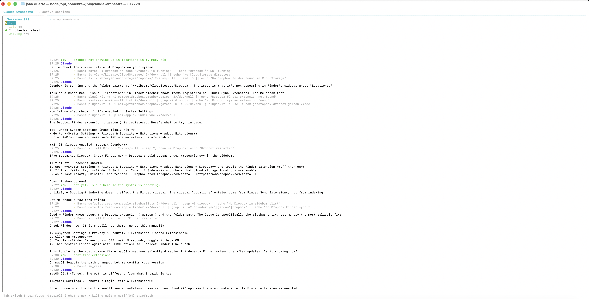
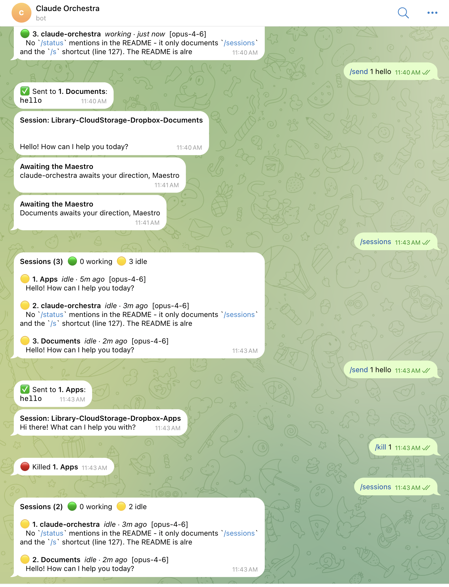

# Claude Orchestra

Terminal dashboard for monitoring and managing multiple Claude Code sessions in parallel — from your computer or your phone.

Watches `~/.claude/` for active sessions, teams, tasks, and agent messages — renders a live fullscreen TUI with desktop notifications. Built-in Telegram bot gives you **full remote control from your phone**: check session status, send messages to agents, start new sessions, kill running ones — everything you can do in the terminal, you can do from Telegram. When your sessions need attention, the Orchestra lets you know: *"Awaiting the Maestro."*



## Features

- **Live session monitoring** — Detects all running Claude Code sessions across Terminal.app, iTerm2, PyCharm, VS Code, and other terminals/IDEs
- **Working/idle status** — Shows whether each session is actively running tools or waiting for input
- **Teams and tasks** — Tracks Claude Code teams, task progress, and agent statuses
- **Messages** — Displays agent messages with highlighted action items (plan approvals, shutdown requests)
- **Desktop notifications** — macOS/Linux alerts when sessions finish, need input, or require approval
- **Full remote control via Telegram** — Monitor, message, start, and kill sessions from your phone — everything the terminal can do, your phone can too
- **Send to session** — Type messages directly into running sessions via keystroke injection (Terminal.app, iTerm2, PyCharm, JetBrains IDEs)
- **Smart liveness detection** — Filters out closed sessions using process detection, with grace periods to avoid flickering

## Quick Start

**1. Install Node.js** (if you don't have it already):

```sh
brew install node        # macOS (Homebrew)
# or download from https://nodejs.org/ (v20+)
```

**2. Install Claude Orchestra:**

```sh
npm install -g @jbduarte/claude-orchestra
```

**3. Run it in a terminal:**

```sh
claude-orchestra
```

That's it. The dashboard launches fullscreen and auto-detects all running Claude Code sessions.

> **Tip:** You can also run without installing: `npx @jbduarte/claude-orchestra`

To monitor a custom directory instead of `~/.claude/`:

```sh
claude-orchestra /path/to/dir
```

## Keyboard Shortcuts

| Key | Action |
|-----|--------|
| `Tab` / `Shift+Tab` | Switch between sessions |
| `1`–`9` | Jump to session by number |
| `Enter` | Focus the selected session's terminal window |
| `i` | Send a message to the selected session |
| `s` | Start a new Claude session |
| `k` | Kill the selected session |
| `↑` / `↓` | Scroll conversation |
| `g` / `G` | Scroll to top / bottom |
| `n` | Toggle notifications |
| `r` | Force refresh |
| `q` | Quit |

## Dashboard Panels

**Sessions** — Active Claude Code sessions with project name, model, working/idle status, and last activity time

**Teams** — Active teams with members, roles, and status (green = active, yellow = idle, gray = stale)

**Tasks** — Task groups by team with completion counts and per-task status

**Messages** — Recent agent messages across all inboxes, with highlighted action items

## Telegram Bot — Full Control From Your Phone

Everything you can do in the terminal dashboard, you can do from Telegram. Check on your agents while away from the desk, send instructions from the couch, kill a runaway session from the bus. The bot pushes real-time notifications and accepts commands — it's your Orchestra in your pocket.



### Setup

1. Create a bot with [@BotFather](https://t.me/BotFather) on Telegram and get the bot token
2. Get your chat ID (message [@userinfobot](https://t.me/userinfobot) on Telegram)
3. Copy the example config and fill in your credentials:

```sh
cp config.example.json config.json
```

Edit `config.json` with your bot token and chat ID:

```json
{
  "telegram": {
    "botToken": "YOUR_BOT_TOKEN",
    "chatId": "YOUR_CHAT_ID"
  }
}
```

> **Note:** `config.json` is gitignored — your credentials stay local.

4. Restart claude-orchestra — the bot starts automatically

### Telegram Commands

| Command | Description |
|---------|-------------|
| `/sessions` | List all active sessions with status |
| `/send name message` | Send a message to a session by project name or number |
| `/kill name` | Kill a session by project name or number |
| `/new /path/to/project [prompt]` | Start a new Claude session in Terminal.app |
| `/help` | Show available commands |

Sessions can be targeted by **project name** (stable) or by index number:

```
/send orchestra fix the bug    ← by name
/send 1 fix the bug            ← by index
orchestra fix the bug          ← shorthand
```

Shortcuts: `/s` for `/sessions`.

The bot also forwards notifications: session completions, idle alerts, and action items.

## Configuration

Create a `config.json` in the claude-orchestra directory (see `config.example.json`):

```json
{
  "telegram": {
    "botToken": "YOUR_BOT_TOKEN",
    "chatId": "YOUR_CHAT_ID"
  },
  "skipPermissions": false
}
```

| Option | Default | Description |
|--------|---------|-------------|
| `telegram.botToken` | — | Telegram bot token from [@BotFather](https://t.me/BotFather) |
| `telegram.chatId` | — | Your Telegram chat ID from [@userinfobot](https://t.me/userinfobot) |
| `skipPermissions` | `false` | Start new sessions with `--dangerously-skip-permissions`. Only enable this if you understand the implications — it allows Claude to run commands without confirmation. |

> `config.json` is gitignored — your credentials and settings stay local.

## Supported Terminals and IDEs

Session **detection** works with any terminal or IDE — it reads Claude's JSONL files and checks running processes.

Session **send** (keystroke injection) supports:

| App | Window targeting |
|-----|-----------------|
| Terminal.app | TTY-based tab matching |
| iTerm2 | TTY-based tab matching |
| PyCharm | Window title matching |
| IntelliJ IDEA | Window title matching |
| WebStorm | Window title matching |
| Other JetBrains IDEs | Window title matching |
| VS Code | Detection only (send not yet supported) |
| Cursor | Detection only (send not yet supported) |

## How It Works

- Scans `~/.claude/projects/` for JSONL session files modified in the last 4 hours
- Uses `ps` + `lsof` to detect running Claude processes and their working directories
- Filters closed sessions: 5-minute idle threshold before process check, 5-minute grace period after close
- Auto-kills orphaned child processes from closed sessions
- Uses CPU usage detection to avoid false idle notifications during context compaction
- Watches filesystem with chokidar (200ms debounce) + 5s periodic refresh as safety net
- Per-file mtime caching — only re-parses files that changed
- Resolves System Events process names at runtime for correct IDE window targeting

## Development

```sh
git clone https://github.com/jbduarte/claude-orchestra.git
cd claude-orchestra
npm install
npm start        # run with tsx
npm run dev      # run with tsx --watch
npm run build    # compile to dist/
```

## Requirements

- **Node.js >= 20** — Install from [nodejs.org](https://nodejs.org/) or via Homebrew: `brew install node`
- **npm** — Included with Node.js (no separate install needed)
- **macOS** — Notifications and keystroke injection use AppleScript/System Events
- **Linux** — Session detection and dashboard work; notifications use notify-send; keystroke injection not available

## License

MIT
